# 👨‍💻 Bhavesh Chand Upadhyay

<div align="center">

### 🔥 Full Stack Developer | MERN Enthusiast | AI/LLM Explorer | Problem Solver

[](https://github.com/visbhavesh)

<br>

**Welcome to my GitHub profile! I'm a passionate developer building intelligent, scalable applications.**


<br>


</div>

---

## 🎯 Quick Overview

```javascript
const bhavesh = {
    📍: "Varanasi, Uttar Pradesh, India 🇮🇳",
    💼: "Software Developer @ SAMS Noida",
    
    🔧: {
        languages: ["JavaScript", "Python", "TypeScript", "Java", "C++"],
        frontend: ["React.js", "Next.js", "Vue.js", "HTML5", "CSS3", "Tailwind CSS"],
        backend: ["Node.js", "Express.js", "Django", "FastAPI", "REST APIs"],
        ai_ml: ["LangChain", "OpenAI API", "Claude API", "Hugging Face", "RAG Systems", "Agent Training"],
        databases: ["MongoDB", "PostgreSQL", "MySQL", "Redis", "Pinecone", "Weaviate"],
        tools: ["Git", "Docker", "Firebase", "Vercel", "AWS", "Jupyter"]
    },
    
    🎓: {
        learning: "Vue.js, Advanced LLM Fine-tuning, Multi-Agent Systems",
        passionate_about: ["Web Development", "AI/ML", "System Design", "Open Source"],
    },
    
    💬: "Ask me about MERN, LLM Integration, Algorithms, System Architecture",
    
    😄: "I use console.log() to debug, and that's perfectly fine! 🐛"
};
```

---

## 💼 Currently

| 🔭 | **Working On** | Software Development & AI/LLM Projects @ SAMS Noida |
|:---:|:---|:---|
| 🤖 | **AI Focus** | LLM Integration, RAG Systems, Agent Architecture |
| 🌱 | **Learning** | Advanced LLM Fine-tuning, Multi-Agent Patterns |
| 🎯 | **Goals** | Build production-grade AI applications, Open source contribution |
| 💡 | **Interested In** | Full-Stack Development, System Design, Machine Learning |
| 📧 | **Email** | [bhaveshchand28@gmail.com](mailto:bhaveshchand28@gmail.com) |
| 💰 | **Support** | [Google Pay](#💰-support-my-work) • [Buy Me Coffee](#💰-support-my-work) |

---

## 🛠️ Tech Stack

<div align="center">

### 📝 Languages


### 🎨 Frontend


### ⚙️ Backend


### 🤖 AI & ML


### 🗄️ Databases


### 🛠️ Tools & DevOps


</div>

---

## 📊 GitHub Analytics Dashboard

<div align="center">

### 🔴 Real-Time Statistics

```
┌─────────────────────────────────────────────┐
│   GitHub Profile Performance Metrics         │
├─────────────────────────────────────────────┤
│  👥 Followers       : Actively Growing      │
│  ⭐ Total Stars     : Check your repos      │
│  📦 Repositories    : 25+ Public Projects   │
│  🔥 Streak          : Keep it Burning! 🔥   │
│  📈 Contribution    : Consistent Daily Work │
│  🏆 Achievements    : Growing Portfolio     │
└─────────────────────────────────────────────┘
```

### 📈 Performance Metrics


### 💻 Most Used Languages


### 🔥 Daily Commit Streak


### 📊 Contribution Graph


### 🏆 GitHub Trophies & Achievements


</div>

---

## 🤖 LLM & AI Development Expertise

<div align="center">

### 🧠 Large Language Models

**Core Competencies:**
- **LLM Integration** → OpenAI GPT-4, Claude 3, Open Source Models
- **RAG Systems** → Retrieval-Augmented Generation Pipelines
- **Prompt Engineering** → Advanced techniques for optimal responses
- **Agent Architecture** → Multi-agent systems with tool integration
- **Fine-tuning** → Custom model training for specific domains
- **Vector Databases** → Pinecone, Weaviate, Milvus integration

### 🔧 AI Stack Implementation

```mermaid
graph LR
    A["LLM API<br/>OpenAI/Claude"] -->|Chain| B["LangChain<br/>Orchestration"]
    B --> C["Vector DB<br/>Embeddings"]
    C --> D["RAG<br/>Pipeline"]
    D --> E["Agent<br/>Tools"]
    E --> F["App<br/>Frontend"]
    
    style A fill:#412991
    style B fill:#1C3C3C
    style C fill:#FF6B6B
    style D fill:#4ECDC4
    style E fill:#FFD93D
    style F fill:#6BCB77
```



### 🚀 Recent AI Projects

| Project | Tech Stack | Features |
|---------|-----------|----------|
| 🤖 **AI Chat Application** | Next.js, LangChain, OpenAI, MongoDB | Real-time RAG, Memory Management, Streaming |
| 🔍 **Code Review Agent** | Python, FastAPI, LLaMA, Vector DB | Code Analysis, Security Scanning, Suggestions |
| 📊 **Data Intelligence** | Node.js, Claude API, PostgreSQL | Analytics, Predictions, Natural Language Queries |
| 🌐 **Multi-Agent System** | Python, LangChain, Tool Integration | Collaborative agents, Complex task solving |

</div>

---

## 💡 Featured Projects Showcase

<table>
<tr>
<td width="50%">

### 🤖 AI Chat Platform
**Next.js | LangChain | OpenAI**

Advanced conversational AI with:
- Real-time streaming responses
- RAG integration
- Memory management
- Document uploads
- Cost optimization

[View Code](https://github.com/visbhavesh) | [Live Demo](https://bhavesh-ai-chat.vercel.app)

</td>
<td width="50%">

### 📊 Analytics Dashboard
**React | Node.js | PostgreSQL**

Interactive analytics with:
- Real-time data visualization
- Machine learning predictions
- Custom report generation
- Data export functionality
- Performance monitoring

[View Code](https://github.com/visbhavesh) | [Live Demo](https://bhavesh-analytics.vercel.app)

</td>
</tr>
<tr>
<td width="50%">

### 🔍 Code Review Agent
**Python | FastAPI | LLaMA**

Intelligent code analysis:
- Automatic code review
- Security vulnerability detection
- Performance optimization suggestions
- Documentation generation
- Refactoring recommendations

[View Code](https://github.com/visbhavesh) | [Demo](https://github.com/visbhavesh)

</td>
<td width="50%">

### 🌐 Multi-Agent Framework
**Python | LangChain | Claude**

Collaborative agent system:
- Tool integration
- Task decomposition
- Agent coordination
- State management
- Extensible architecture

[View Code](https://github.com/visbhavesh) | [Docs](https://github.com/visbhavesh)

</td>
</tr>
</table>

---

## 📈 Recent Activity & Contributions

<div align="center">

### ✨ What I'm Working On Right Now

```
🔴 ACTIVE PROJECTS
├── 🤖 LLM Integration Framework
├── 📦 RAG Pipeline Optimization
├── 🔧 Multi-Agent System Development
├── 📚 Documentation & Tutorials
└── 🎓 Learning Advanced Techniques

📌 FOCUS AREAS
├── Production-Grade AI Systems
├── Scalability & Performance
├── Cost Optimization
└── Best Practices & Patterns
```

### 🎯 Development Focus Areas

**Week by Week Progress:**
- ⚡ Monday-Wednesday: Core Development
- 🧪 Thursday: Testing & Optimization
- 📚 Friday: Learning & Research
- 🔄 Weekend: Open Source & Contributions

</div>

---

## 🌐 Connect & Collaborate

<div align="center">

### 📱 Get In Touch

[](mailto:bhaveshchand28@gmail.com)
[](https://linkedin.com/in/bhavesh-upadhyay)
[](https://github.com/visbhavesh)
[](https://twitter.com/visbhavesh)

### 💬 Let's Talk About
- 💼 Full-Stack Development & Architecture
- 🤖 AI/LLM Integration & Deployment
- 🚀 Scalable System Design
- 🎓 Learning & Mentorship
- 🌟 Open Source Contributions

</div>

---

## 💰 Support My Work

<div align="center">

### ❤️ Help Me Build Better Projects

If you find my work valuable and want to support my development journey:

| Payment Method | Details |
|:-:|:-:|
| 💳 **Google Pay** | **UPI:** `bhaveshchand28@okhdfcbank` |
| 💳 **Google Pay** | **UPI:** `bhaveshchand28@oksbi` |
| ☕ **Buy Me Coffee** | [Support via BMC](https://www.buymeacoffee.com/visbhavesh) |
| 🎨 **Ko-Fi** | [Support via Ko-Fi](https://ko-fi.com/visbhavesh) |

### 💪 Why Support?

Your support helps me:
- ✨ Continue building open-source projects
- 📚 Learn and master new technologies
- 🚀 Create high-quality tutorials & content
- 🎯 Contribute to the developer community
- 💡 Build innovative AI/LLM applications

**Every contribution (₹10, ₹20, ₹50, or more) makes a huge difference!** 🙏

### 📊 Support Impact
```
₹10-20   → Coffee ☕ (1 day of code)
₹50-100  → Meal 🍽️ (dedicated project time)
₹200+    → Extended development time 🚀
```

</div>

---

## 🎓 Learning & Growth

<div align="center">

### 📚 Current Learning Path

```
Phase 1: LLM Mastery (Current)
├── Advanced Prompt Engineering
├── Fine-tuning Techniques
├── RAG Pipeline Optimization
└── Vector Database Management

Phase 2: Production Systems
├── Scalability & Performance
├── Cost Optimization Strategies
├── Monitoring & Observability
└── Enterprise Deployment

Phase 3: Leadership & Community
├── Open Source Contributions
├── Mentoring Developers
├── Technical Writing
└── Speaking & Workshops
```

### 📖 Resources I Use

- [LangChain Docs](https://python.langchain.com) - LLM Framework
- [OpenAI API](https://platform.openai.com/docs) - GPT Models
- [Anthropic Claude](https://docs.claude.com) - Claude API
- [Hugging Face](https://huggingface.co/docs) - Model Hub
- [System Design Interview](https://github.com/donnemartin/system-design-primer) - Architecture

</div>

---

## 🎯 Personal Mission

<div align="center">

> ### "Build intelligent systems that solve real-world problems and make technology accessible to everyone."

**Core Values:**
- 🎯 **Excellence** - Writing clean, efficient code
- 🤝 **Collaboration** - Helping others grow
- 📚 **Continuous Learning** - Staying ahead of the curve
- 🌍 **Impact** - Creating solutions that matter
- 💪 **Resilience** - Overcoming challenges

</div>

---

## 🏅 Achievements & Milestones

<div align="center">

### 🌟 Notable Accomplishments

```
✅ 25+ GitHub Projects
✅ 100+ Stars Earned
✅ Active Open Source Contributor
✅ Full-Stack MERN Specialist
✅ AI/LLM Integration Expert
✅ System Design Knowledge
✅ Mentored 10+ Developers
✅ Technical Articles Written
```

### 📜 Certifications & Learning

- 🎓 Full-Stack Web Development
- 🎓 Data Structures & Algorithms
- 🎓 Machine Learning Fundamentals
- 🎓 Advanced LLM Development (In Progress)
- 🎓 System Design Patterns (In Progress)

</div>

---

## 📊 Profile Summary Card

<div align="center">


</div>

---

## 🚀 Quick Links

<div align="center">

| 🏠 | 👨‍💻 | 📦 | 🌐 |
|:---:|:---:|:---:|:---:|
| [Portfolio](https://visbhavesh.dev) | [GitHub](https://github.com/visbhavesh) | [NPM](https://www.npmjs.com/~visbhavesh) | [Blog](https://visbhavesh.dev/blog) |

</div>

---

<div align="center">

### 🎬 Thanks for Visiting!


**Made with ❤️ by Bhavesh Upadhyay**

*"Code today, legend tomorrow!"* 🚀


### ⭐ If you found this helpful, please consider giving a star! ⭐

</div>
