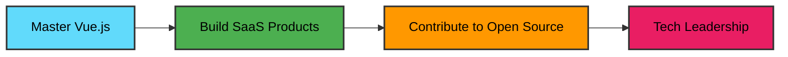

<div align="center">

# 👨‍💻 Bhavesh Chand Upadhyay

### Full Stack Developer | MERN Enthusiast | Problem Solver

[](https://git.io/typing-svg)


[](https://github.com/visbhavesh)

</div>

---

## 🚀 About Me

```javascript
const bhavesh = {
    location: "India 🇮🇳",
    currentRole: "Software Developer @ SAMS Noida",
    code: ["JavaScript", "Python", "Java", "C++", "TypeScript"],
    technologies: {
        frontEnd: ["React", "Next.js", "HTML5", "CSS3", "Bootstrap"],
        backEnd: ["Node.js", "Express.js", "Django"],
        databases: ["MongoDB", "PostgreSQL", "MySQL", "Redis"],
        tools: ["Git", "Firebase", "Figma"]
    },
    currentlyLearning: "Vue.js",
    askMeAbout: ["Web Dev", "MERN Stack", "Algorithms", "System Design"],
    funFact: "I debug with console.log() and I'm not ashamed! 😄"
};
```

---

## 💼 What I'm Up To

<table>
  <tr>
    <td>🔭</td>
    <td><b>Currently Working:</b> Software Developer at SAMS Noida</td>
  </tr>
  <tr>
    <td>🌱</td>
    <td><b>Tech Stack:</b> React.js, Next.js, Express.js, Node.js, Python, Django</td>
  </tr>
  <tr>
    <td>🤝</td>
    <td><b>Looking to Learn:</b> Vue.js - Let's connect if you can help!</td>
  </tr>
  <tr>
    <td>💬</td>
    <td><b>Ask Me About:</b> C++, Java, Python, JavaScript, MERN Stack</td>
  </tr>
  <tr>
    <td>📫</td>
    <td><b>Reach Me:</b> <a href="mailto:bhaveshchand28@gmail.com">bhaveshchand28@gmail.com</a></td>
  </tr>
</table>

---

## 🛠️ Tech Stack

<div align="center">

### Languages


### Frontend


### Backend


### Databases


### Tools & Others


</div>

---

## 📊 GitHub Statistics

<div align="center">
  
  
</div>

<div align="center">
  
</div>

<div align="center">
  
</div>

---

## 🏆 GitHub Trophies

<div align="center">
  
</div>

---

## 🤝 Connect With Me

<div align="center">

[](https://linkedin.com/in/bhavesh-upadhyay)
[](mailto:bhaveshchand28@gmail.com)
[](https://github.com/visbhavesh)

</div>

---

## 💭 Random Dev Quote

<div align="center">


</div>

---

## 🐍 Contribution Snake

<div align="center">


</div>

---

## 📈 Recent Activity

<!--START_SECTION:activity-->
<!--END_SECTION:activity-->

---

## 🎯 Current Goals

<div align="center">



</div>

---

## 📚 Latest Blog Posts

<!-- BLOG-POST-LIST:START -->
<!-- BLOG-POST-LIST:END -->

---

## 💪 Support My Work

<div align="center">

If you find my projects helpful, consider buying me a coffee! ☕

[](https://www.buymeacoffee.com/visbhavesh)
[](https://ko-fi.com/visbhavesh)

</div>

---

<div align="center">

### 📊 Weekly Development Breakdown

<!--START_SECTION:waka-->
<!--END_SECTION:waka-->

</div>

---

<div align="center">

## 🎵 Currently Vibing To

[](https://spotify-github-profile.kittinanx.com/api/view?uid=YOUR_SPOTIFY_ID&redirect=true)

</div>

---

<div align="center">

### ✨ Profile Views & Stars


[](https://github.com/visbhavesh?tab=followers)
[](https://github.com/visbhavesh)

---

### 🌟 Featured Projects

</div>

<table align="center">
<tr>
<td width="50%">
<h3 align="center">Project Name 1</h3>
<div align="center">
<a href="https://github.com/visbhavesh/project1" target="_blank">

</a>
<br>
<br>
<p>
<a href="https://github.com/visbhavesh/project1" target="_blank">

</a>
<a href="https://project1-demo.com" target="_blank">

</a>
</p>
<p><strong>React, Node.js, MongoDB</strong> - Brief project description here showcasing your best work.</p>
</div>
</td>

<td width="50%">
<h3 align="center">Project Name 2</h3>
<div align="center">
<a href="https://github.com/visbhavesh/project2" target="_blank">

</a>
<br>
<br>
<p>
<a href="https://github.com/visbhavesh/project2" target="_blank">

</a>
<a href="https://project2-demo.com" target="_blank">

</a>
</p>
<p><strong>Python, Django, PostgreSQL</strong> - Brief project description showcasing your technical skills.</p>
</div>
</td>
</tr>
</table>

---

<div align="center">

### 💡 Fun Facts About Me


</div>

---

<div align="center">

### 🏅 Achievements & Certifications

[](https://www.credly.com/badges/your-badge)
[](https://www.credential.net/your-credential)
[](https://www.coursera.org/account/accomplishments/verify/YOUR_CERT)

</div>

---

<div align="center">

### 🤝 Let's Collaborate!

I'm always interested in collaborating on interesting projects. Feel free to reach out if you want to:
- 🚀 Build something amazing together
- 💡 Discuss new technologies
- 🎯 Work on open-source projects
- 📚 Share knowledge and learn

[](mailto:bhaveshchand28@gmail.com)

</div>

---

<div align="center">

## 📊 Detailed GitHub Metrics


</div>

---

<div align="center">


<br>

**⭐ From [Visbhavesh](https://github.com/visbhavesh) with ❤️**

*"First, solve the problem. Then, write the code." – John Johnson*

<br>


</div>
