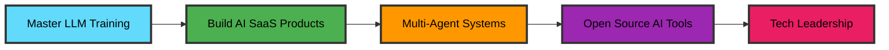

<div align="center">

# 👨‍💻 Bhavesh Chand Upadhyay

### Full Stack Developer | AI/ML Engineer | MERN Enthusiast

[](https://git.io/typing-svg)


[](https://github.com/visbhavesh)
[](https://github.com/visbhavesh?tab=followers)
[](https://github.com/visbhavesh)

</div>

---

## 🚀 About Me

```javascript
const bhavesh = {
    location: "India 🇮🇳",
    currentRole: "Software Developer @ SAMS Noida",
    currentFocus: "LLM Training & AI Agent Development",
    totalProjects: 77,
    code: ["JavaScript", "Python", "Java", "C++", "TypeScript"],
    technologies: {
        frontEnd: ["React", "Next.js", "HTML5", "CSS3", "Bootstrap"],
        backEnd: ["Node.js", "Express.js", "Django", "FastAPI"],
        databases: ["MongoDB", "PostgreSQL", "MySQL", "Redis", "Pinecone"],
        aiMl: ["LangChain", "OpenAI", "Hugging Face", "TensorFlow", "PyTorch"],
        tools: ["Git", "Docker", "Firebase", "Figma", "AWS"]
    },
    currentlyLearning: ["Vue.js", "Advanced RAG", "Multi-Agent Systems"],
    askMeAbout: ["Web Dev", "MERN Stack", "LLM Applications", "AI Agents"],
    funFact: "I debug with console.log() and I'm not ashamed! 😄"
};
```

---

## 🤖 AI/ML & LLM Expertise

<div align="center">

### Currently Working On

<table>
<tr>
<td align="center" width="33%">

<br><strong>LLM Training</strong>
<br><sub>Fine-tuning & Optimization</sub>
</td>
<td align="center" width="33%">

<br><strong>AI Agents</strong>
<br><sub>Autonomous Systems</sub>
</td>
<td align="center" width="33%">

<br><strong>Neural Networks</strong>
<br><sub>Deep Learning Models</sub>
</td>
</tr>
</table>

### AI Tech Stack


</div>

---

## 💼 What I'm Up To

<table>
<tr>
<td>🔭</td>
<td><b>Current Role:</b> Software Developer at SAMS Noida</td>
</tr>
<tr>
<td>🤖</td>
<td><b>AI Focus:</b> Training LLMs and developing intelligent AI agents</td>
</tr>
<tr>
<td>🌱</td>
<td><b>Learning:</b> Vue.js, Advanced RAG systems, Multi-agent architectures</td>
</tr>
<tr>
<td>🚀</td>
<td><b>Projects:</b> 77+ completed projects across full-stack and AI/ML</td>
</tr>
<tr>
<td>💬</td>
<td><b>Ask Me About:</b> MERN Stack, LLM Applications, AI Agents, System Design</td>
</tr>
<tr>
<td>📫</td>
<td><b>Email:</b> <a href="mailto:bhaveshchand28@gmail.com">bhaveshchand28@gmail.com</a></td>
</tr>
</table>

---

## 🛠️ Complete Tech Stack

<div align="center">

### Languages


### Frontend


### Backend


### Databases & Cloud


### Tools & Others


</div>

---

## 📊 GitHub Statistics

<div align="center">


</div>

<div align="center">


</div>

<div align="center">


</div>

---

## 🎯 Current Goals & Roadmap

<div align="center">



</div>

---

## 💪 Support My Work

<div align="center">

### If you find my work helpful, consider supporting me! ☕

<table>
<tr>
<td align="center" width="50%">

<br><br>
<strong>Google Pay / PhonePe</strong>
<br><br>
<code>bhaveshchand28@oksbi</code>
<br><br>
<sub>Scan or use UPI ID</sub>
</td>
<td align="center" width="50%">

<br><br>
<strong>Buy Me A Coffee</strong>
<br><br>
<a href="https://www.buymeacoffee.com/visbhavesh">

</a>
<br>
<sub>Support via Coffee</sub>
</td>
</tr>
</table>

[](https://github.com/sponsors/visbhavesh)
[](https://paypal.me/visbhavesh)

<sub>Your support helps me create more open-source projects and AI tools! 🚀</sub>

</div>

---

## 🤝 Connect With Me

<div align="center">

[](https://linkedin.com/in/bhavesh-upadhyay)
[](mailto:bhaveshchand28@gmail.com)
[](https://github.com/visbhavesh)
[](https://twitter.com/visbhavesh)
[](https://visbhavesh.github.io)

</div>

---

## 💭 Random Dev Quote

<div align="center">


</div>

---

## 🏅 Achievements

<div align="center">


</div>

---

## 💡 Fun Facts & Skills

<div align="center">


</div>

---

## 🌟 Featured Projects (From 77+ Projects)

<div align="center">

<table>
<tr>
<td width="50%">
<h3 align="center">🤖 AI Chatbot with RAG</h3>
<div align="center">
<a href="https://github.com/visbhavesh/ai-chatbot-rag" target="_blank">

</a>
<br><br>
<p>
<a href="https://github.com/visbhavesh/ai-chatbot-rag" target="_blank">

</a>
</p>
<p><strong>Python, LangChain, OpenAI</strong><br>Advanced RAG system with vector database integration</p>
</div>
</td>

<td width="50%">
<h3 align="center">🚀 Full Stack E-Commerce</h3>
<div align="center">
<a href="https://github.com/visbhavesh/ecommerce-mern" target="_blank">

</a>
<br><br>
<p>
<a href="https://github.com/visbhavesh/ecommerce-mern" target="_blank">

</a>
</p>
<p><strong>React, Node.js, MongoDB</strong><br>Scalable e-commerce platform with payment integration</p>
</div>
</td>
</tr>

<tr>
<td width="50%">
<h3 align="center">🧠 Multi-Agent System</h3>
<div align="center">
<a href="https://github.com/visbhavesh/multi-agent-system" target="_blank">

</a>
<br><br>
<p>
<a href="https://github.com/visbhavesh/multi-agent-system" target="_blank">

</a>
</p>
<p><strong>Python, AutoGen, LangChain</strong><br>Collaborative AI agents for complex tasks</p>
</div>
</td>

<td width="50%">
<h3 align="center">📱 React Native App</h3>
<div align="center">
<a href="https://github.com/visbhavesh/react-native-app" target="_blank">

</a>
<br><br>
<p>
<a href="https://github.com/visbhavesh/react-native-app" target="_blank">

</a>
</p>
<p><strong>React Native, Firebase</strong><br>Cross-platform mobile application</p>
</div>
</td>
</tr>
</table>

### 📦 More Projects

[](https://github.com/visbhavesh?tab=repositories)

</div>

---

## 📈 Contribution Activity

<div align="center">

[](https://github.com/visbhavesh)

</div>

---

## 🤝 Let's Collaborate!

<div align="center">

I'm always interested in collaborating on exciting projects:

✨ **Build AI-powered applications**  
🚀 **Develop full-stack solutions**  
💡 **Contribute to open-source**  
📚 **Share knowledge & learn together**  
🤖 **Work on LLM & Agent projects**

[](mailto:bhaveshchand28@gmail.com)

</div>

---

<div align="center">


<br>

**⭐ From [Bhavesh Chand Upadhyay](https://github.com/visbhavesh) with ❤️**

*"First, solve the problem. Then, write the code." – John Johnson*

<br>


</div>
